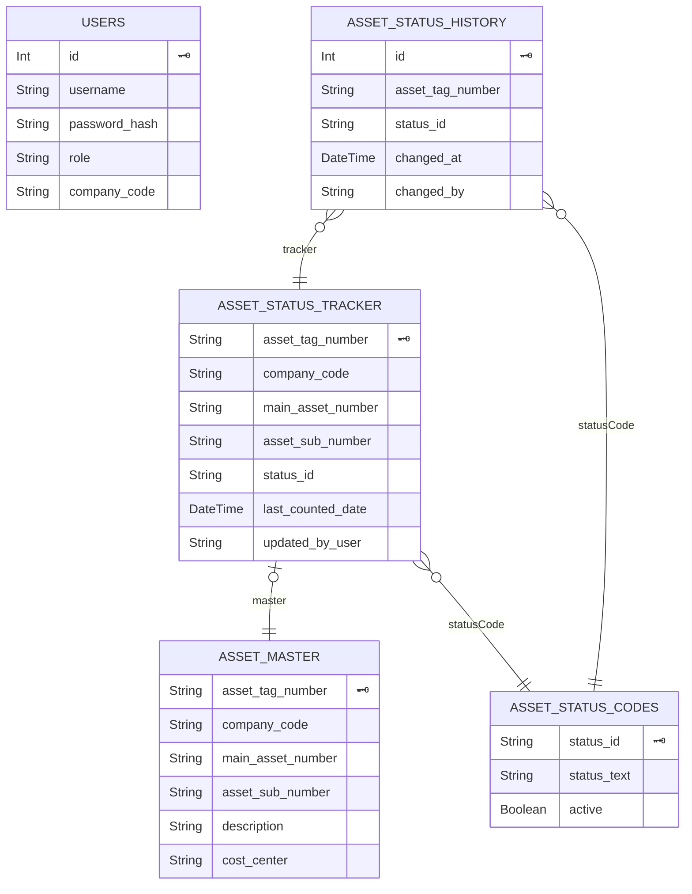

```mermaid
erDiagram

  "USERS" {
    Int id "🗝️"
    String username 
    String password_hash 
    String role 
    String company_code 
    }
  

  "ASSET_MASTER" {
    String asset_tag_number "🗝️"
    String company_code 
    String main_asset_number 
    String asset_sub_number 
    String description 
    String cost_center 
    }
  

  "ASSET_STATUS_CODES" {
    String status_id "🗝️"
    String status_text 
    Boolean active 
    }
  

  "ASSET_STATUS_TRACKER" {
    String asset_tag_number "🗝️"
    String company_code 
    String main_asset_number 
    String asset_sub_number 
    String status_id 
    DateTime last_counted_date 
    String updated_by_user 
    }
  

  "ASSET_STATUS_HISTORY" {
    Int id "🗝️"
    String asset_tag_number 
    String status_id 
    DateTime changed_at 
    String changed_by 
    }
  
    "ASSET_STATUS_TRACKER" |o--|| ASSET_MASTER : "master"
    "ASSET_STATUS_TRACKER" }o--|| ASSET_STATUS_CODES : "statusCode"
    "ASSET_STATUS_HISTORY" }o--|| ASSET_STATUS_TRACKER : "tracker"
    "ASSET_STATUS_HISTORY" }o--|| ASSET_STATUS_CODES : "statusCode"
```
